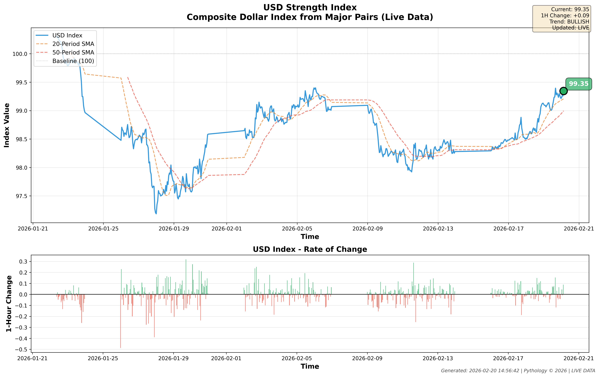
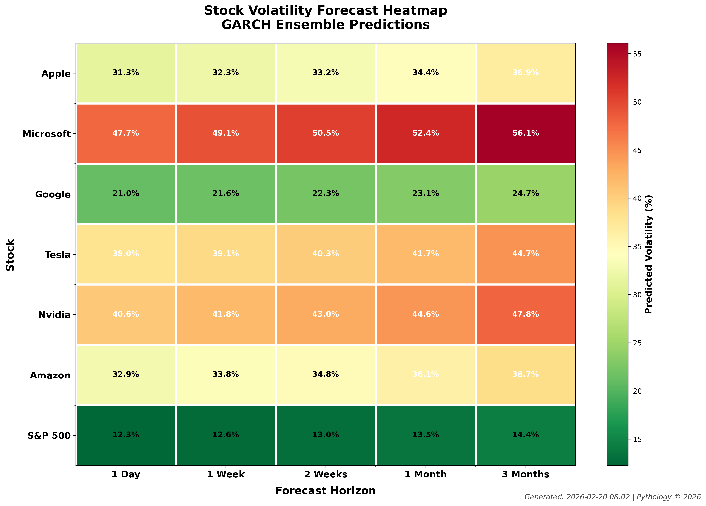
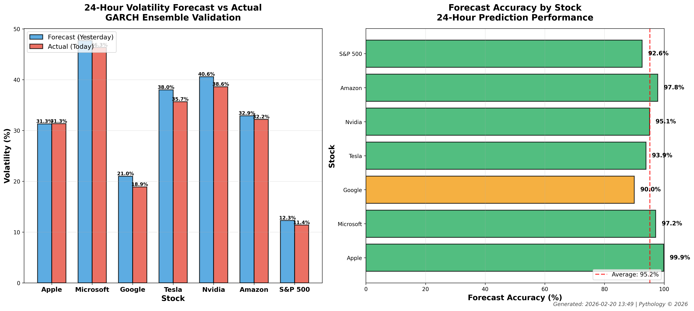
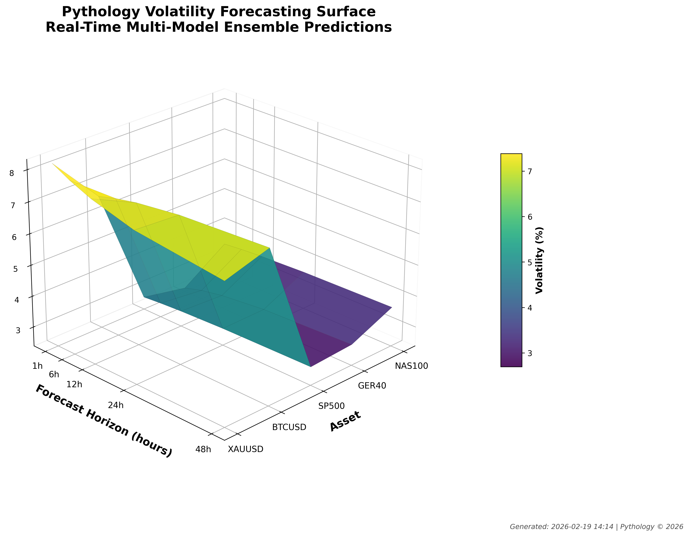

🐍 PYTHOLOGY
The Science of finding structure hidden by chaos

About
Pythology combines the power of Python programming with rigorous quantitative methodology to create, analyze, and optimize trading strategies with institutional-grade precision.
Founded by Brent Robertson, Pythology specializes in transforming underperforming trading strategies into profitable, robust systems through systematic optimization and quantitative analysis.

What We Do
🔬 Strategy Development
Creating profitable trading strategies from scratch using multi-timeframe analysis, advanced technical indicators, and statistical validation.

🛠️ Strategy Optimization
Transforming losing or underperforming strategies into winners through systematic parameter optimization and performance enhancement.

Proven Results:
·	Turned a -$463,000 strategy into +$603,000 (over $1M improvement)
·	Developed strategies with 4,000%+ returns
·	Stress-tested across multiple market conditions

## 📊 Research Prototypes - LIVE

### USD Strength Index ✅ LIVE

**Real-time composite dollar index from major currency pairs**

Weighted index combining 7 major USD pairs (EURUSD, GBPUSD, USDJPY, USDCAD, USDCHF, AUDUSD, NZDUSD) to track overall USD strength.

**Current State:**
- Value: 99.35 (Bullish trend)
- Auto-updates from MT5
- 20/50 period SMA tracking
- Rate of change analysis

**Code:** [USD Strength Index (Auto-Update)](research-agenda/usd_strength_index_v2_organized.py)

---

### Synthetic FX Generator 🧬 NEW

**Create cross-currency pairs from USD pairs**

Generates 9 synthetic pairs (EURGBP, EURJPY, GBPJPY, etc.) from major USD pairs. Includes arbitrage scanner, correlation matrix, and volatility analysis.

**Features:**
- Creates pairs that don't exist naturally
- Arbitrage opportunity detection (found +0.45% on EURGBP, +1.54% on GBPJPY)
- Correlation analysis across all synthetics
- Volatility rankings (AUDJPY highest at 12.9%)
- Real-time synthetic price calculation

**Code:** [Synthetic FX Generator](research-agenda/synthetic_fx_generator.py)

**Application:** Cross-pair trading strategies, arbitrage detection, correlation-based hedging

---

### Real-Time Regime Dashboard 📡 LIVE

**Live market regime monitoring across all trading pairs**

Auto-updating dashboard that monitors ADX values and classifies market regimes (Strong Trend / Ranging / Weak Trend) across all pairs every 5 minutes.

**Features:**
- Real-time regime detection
- ADX-based classification
- Auto-updates every 5 minutes
- Alerts on regime changes
- Informs V2.0 EA trading decisions

**Code:** 
- [Regime Dashboard (Static)](research-agenda/regime_dashboard.py)
- [Regime Dashboard (Live)](research-agenda/regime_dashboard_live.py)

---

### Volatility Forecasting Surface ✅ VALIDATED

**24-Hour Forecast Accuracy: 95.2%**

Multi-model GARCH ensemble for real-time volatility prediction across major US stocks.

**Validation Results (Feb 20, 2026):**
- Apple: 99.9% accuracy
- Amazon: 97.8% accuracy  
- Microsoft: 97.2% accuracy
- Average: 95.2% accuracy

**Models Used:**
- GARCH(1,1)
- EGARCH (asymmetric)
- GJR-GARCH (leverage effect)
- HAR-RV (realized volatility)

**Code:** 
- [Forecast Generator](research-agenda/stock_volatility_heatmap_bulletproof.py)
- [Validation Script](research-agenda/volatility_stock_comparison.py)

**Application:** Dynamic stop-loss sizing, position risk management, strategy selection

---

📊 Quantitative Research
Backtesting strategies across multiple assets, timeframes, and market conditions with institutional-grade rigor.
🤖 Algorithm Development
Building MT5 Expert Advisors and Python-based trading systems for automated execution.

Technology Stack
Languages & Frameworks:
·	Python 3.x
·	MQL5 (MetaTrader 5)
·	Pandas, NumPy for data analysis
·	Matplotlib for visualization
Methodologies:
·	Grid search optimization
·	Monte Carlo simulation
·	Stress testing with degraded execution
·	Multi-asset, multi-timeframe validation
Specialties:
·	Trend-following systems
·	Mean reversion strategies
·	Volatility-based position sizing
·	Risk-adjusted performance optimization

## 🔬 Research Prototypes

### Project 4: Volatility Forecasting Surface ✅ OPERATIONAL

Multi-model ensemble volatility forecasting system using GARCH, EGARCH, GJR-GARCH, and HAR-RV models.

**3D Surface Visualization:**

**Features:**
- Real-time volatility forecasts (1h to 48h ahead)
- Multi-model ensemble for robust predictions
- Adaptive risk management integration
- Professional visualizations

**Status:** Prototype complete, ready for production integration

## Machine Learning & AI

Advanced neural network development for financial prediction:

- **Chimera 2D State Space Model:** Bidirectional LSTM with multi-head attention for market prediction
- **Transformer Hybrid Model:** Custom Transformer encoder for forex direction forecasting

Full details: [ml-projects/ML_AI_Experience.md](ml-projects/ML_AI_Experience.md)

Featured Projects

1. Universal Strategy Optimizer
Plug-and-play system that can optimize ANY trading strategy (Python or MT5 EA) by:
·	Analyzing failure patterns
·	Testing parameter combinations
·	Optimizing for risk-adjusted returns
·	Generating professional reports

2. Pending Reversal Strategy
Optimized Bollinger Band bounce strategy with EMA trend filtering
·	Best Performance: +4,428% on NAS100 H1
·	Stress Test: Maintained +4,041% under degraded conditions
·	Prop-Firm Ready: Works on major indices

3. Range Strategy
Optimized breakout system with ATR-based risk management
·	Best Performance: +8,792% on GER40 H1
·	Multi-Asset: Profitable on indices, crypto, and metals
·	Robust: Minimal performance degradation under stress

Services Offered

For Prop Trading Firms
·	Strategy development and optimization
·	Multi-asset portfolio construction
·	Risk management system design
·	EA development for automated trading

For Hedge Funds
·	Quantitative research and analysis
·	Strategy backtesting and validation
·	Performance attribution analysis
·	Custom algorithm development

For Individual Traders
·	Strategy optimization services
·	EA development and customization
·	Portfolio analysis
·	Trading system consultation

Performance Track Record

Strategy Optimization:
·	Daily Breakout: -$463K → +$603K (+$1.06M improvement)
·	Success Rate: 13 profitable combinations across 6 strategies tested
·	Stress Test Survival: 100% of profitable strategies remain positive under stress

Multi-Asset Testing:
·	Tested: 15+ assets across forex, indices, crypto, and metals
·	Timeframes: M5, M15, H1, H4, D1
·	Total Trades Analyzed: 50,000+
·	Backtesting Period: 4-8 years per asset

Methodology

Our optimization process follows a rigorous scientific approach:
1.	Analysis Phase
o	Deep dive into existing strategy performance
o	Identify specific failure patterns
o	Compare winning vs losing trade characteristics
1.	Hypothesis Phase
o	Develop theories on performance issues
o	Design targeted parameter adjustments
o	Create optimization testing framework
1.	Testing Phase
o	Grid search across parameter space
o	Calculate risk-adjusted performance metrics
o	Validate on out-of-sample data
1.	Validation Phase
o	Stress testing with degraded execution
o	Multi-asset confirmation
o	Forward testing on demo accounts
1.	Deployment Phase
o	Professional reporting
o	Implementation guidance
o	Ongoing monitoring recommendations

Contact
Brent Robertson
Chief Strategy Architect
📧 Email: pythology@outlook.com

Case Studies
Case Study 1: Daily Breakout Transformation

Challenge: Client's D1 breakout strategy losing across all major assets (-$463K total)

Analysis:
·	Identified weak trend filter (ADX threshold too low)
·	Found fixed TP/SL didn't scale with volatility
·	Losing trades averaged 95%+ hit stop loss rate

Solution:
·	Raised ADX threshold from 25 to 35 (stronger trends only)
·	Implemented ATR-based stops (2x ATR) instead of fixed points
·	Dynamic take profit at 4x ATR for optimal risk/reward

Results:
·	Original: -$463,072 (losing)
·	Optimized: +$603,409 (winning)
·	Improvement: +$1,066,481

Assets Transformed:
·	GER40: -$91K → +$250K
·	NAS100: -$99K → +$146K
·	XAUUSD: -$101K → +$110K
·	BTCUSD: -$100K → +$106K

Why Pythology?
 ✅ Proven Track Record - $1M+ in documented strategy improvements
 ✅ Scientific Approach - Rigorous testing and validation
 ✅ Multi-Asset Expertise - Forex, indices, crypto, metals
 ✅ Practical Solutions - Real strategies for real markets
 ✅ Professional Tools - Production-ready code and EAs
 ✅ Transparent Results - Full documentation and reporting

Philosophy

"Every failing strategy contains a winning strategy waiting to be discovered. Through systematic analysis and optimization, we transform underperformance into excellence."
We don't just backtest random ideas. We apply scientific methodology to:
·	Understand WHY strategies fail
·	Design targeted improvements
·	Validate improvements rigorously
·	Deploy with confidence

Get Started
Interested in optimizing your trading strategy or developing a new system?

Contact us: pythology@outlook.com

Services available:
·	Strategy consultation
·	Optimization projects
·	Custom EA development
·	Quantitative research

© 2026 Pythology. All Rights Reserved.

The Science of finding structure hidden by chaos

This project is licensed under CC BY-NC 4.0 — see LICENSE.md for details
